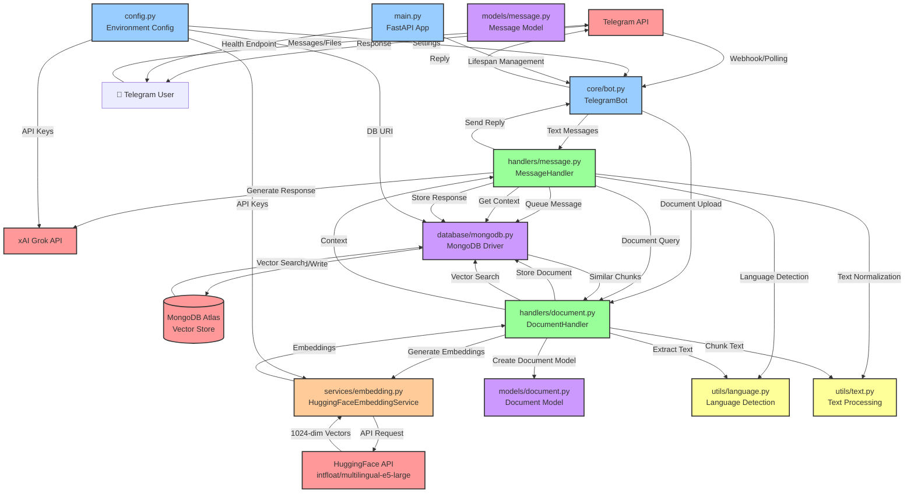
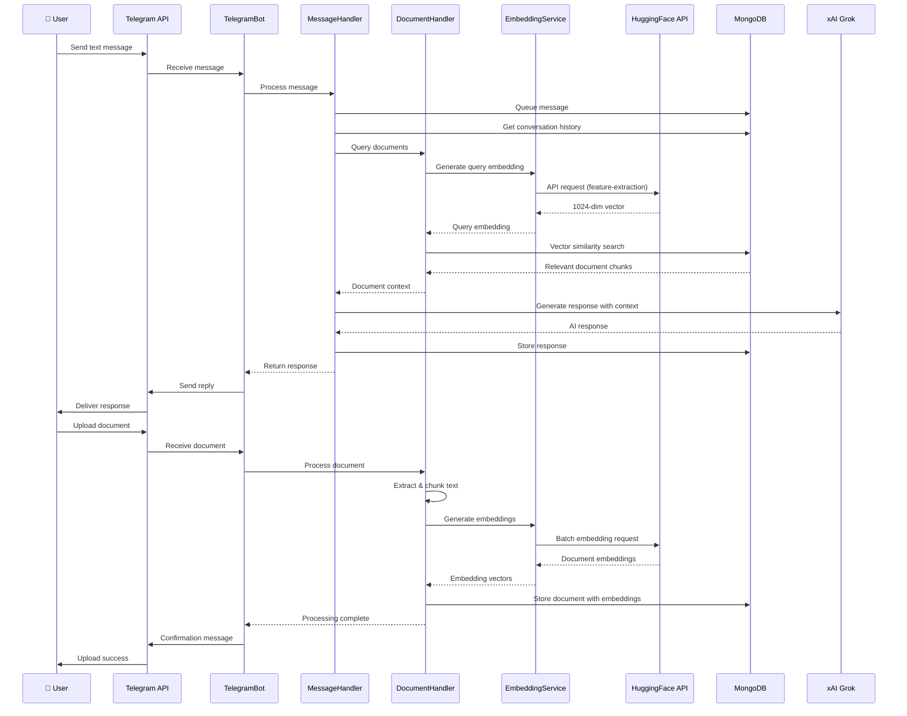
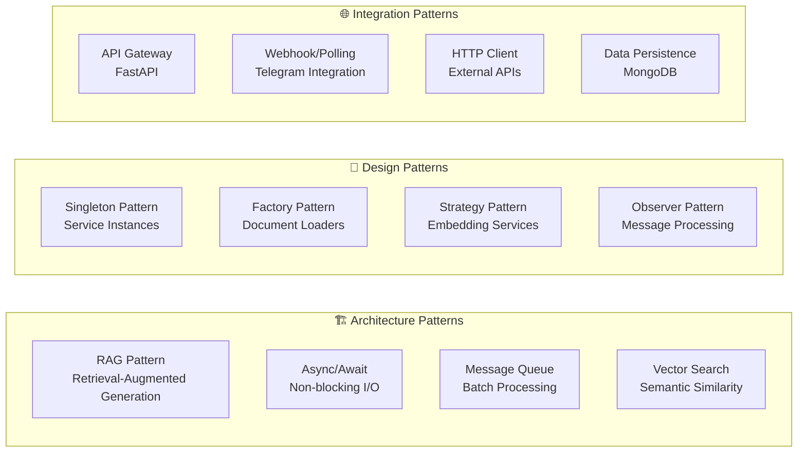
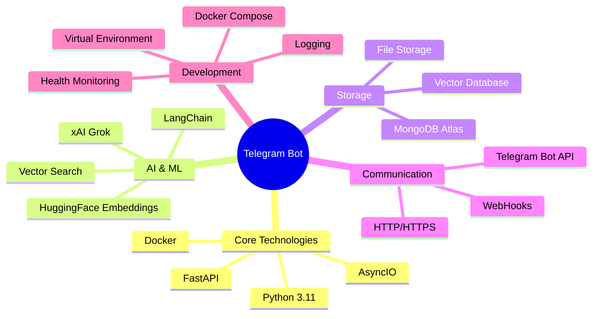

# Telegram Multi-Agent AI Bot - Architecture Analysis & Dataflow

## Overall Application Structure

## Detailed Component Interaction Flow

## Key Architecture Patterns

## Technology Stack Overview

