# Telegram Multi-Agent AI Bot - Complete Architecture Analysis

## System Overview Mermaid Diagram

```mermaid
flowchart TD
    %% External Components
    User[👤 Telegram User]
    TG[📱 Telegram API]
    HF[🤗 HuggingFace API<br/>intfloat/multilingual-e5-large<br/>Feature Extraction]
    XAI[🤖 xAI Grok API<br/>LLM Chat]
    
    %% Main Application Components
    subgraph "🐳 Docker Container"
        subgraph "FastAPI Application"
            Main[📦 main.py<br/>FastAPI Server]
            Health[🔍 /health endpoint]
        end
        
        subgraph "Core Bot System"
            Bot[🤖 TelegramBot<br/>app/core/bot.py]
            MsgHandler[💬 MessageHandler<br/>app/handlers/message.py]
            DocHandler[📄 DocumentHandler<br/>app/handlers/document.py]
        end
        
        subgraph "Services Layer"
            EmbedSvc[🧠 HuggingFaceEmbeddingService<br/>app/services/embedding.py]
            EmbedFactory[🏭 EmbeddingServiceFactory]
        end
        
        subgraph "Data Models"
            MsgModel[📝 Message Model<br/>app/models/message.py]
            DocModel[📄 Document Model<br/>app/models/document.py]
        end
        
        subgraph "Database Layer"
            MongoDB[🗄️ MongoDB Handler<br/>app/database/mongodb.py]
        end
        
        subgraph "Utilities"
            TextUtils[📝 Text Utils<br/>app/utils/text.py]
            LangUtils[🌍 Language Utils<br/>app/utils/language.py]
        end
    end
    
    %% External Database
    DB[(🍃 MongoDB Atlas<br/>Vector Database)]
    
    %% Data Flow - Message Processing
    User -->|1. Send Message| TG
    TG -->|2. Webhook/Polling| Bot
    Bot -->|3. Store Message| MongoDB
    MongoDB -->|4. Queue Message| DB
    
    Bot -->|5. Process Queue| MsgHandler
    MsgHandler -->|6. Get Context| MongoDB
    MongoDB -->|7. Fetch History| DB
    
    MsgHandler -->|8. Query Documents| DocHandler
    DocHandler -->|9. Generate Query Embedding| EmbedSvc
    EmbedSvc -->|10. Feature Extraction| HF
    HF -->|11. Return 1024-dim Vectors| EmbedSvc
    EmbedSvc -->|12. Vector Embeddings| DocHandler
    
    DocHandler -->|13. Vector Search| MongoDB
    MongoDB -->|14. Similar Documents| DB
    DB -->|15. Document Context| MongoDB
    MongoDB -->|16. Context Data| DocHandler
    DocHandler -->|17. Formatted Context| MsgHandler
    
    MsgHandler -->|18. Generate Response| XAI
    XAI -->|19. AI Response| MsgHandler
    MsgHandler -->|20. Final Response| Bot
    Bot -->|21. Send Reply| TG
    TG -->|22. Deliver Message| User
    
    %% Data Flow - Document Upload (PDF Only)
    User -->|A1. Upload PDF| TG
    TG -->|A2. File Data| Bot
    Bot -->|A3. Download File| Bot
    Bot -->|A4. Process Document| DocHandler
    
    DocHandler -->|A5. Extract Text (PyPDFLoader)| DocHandler
    DocHandler -->|A6. Split Chunks (1000 chars)| DocHandler
    DocHandler -->|A7. Generate Embeddings| EmbedSvc
    EmbedSvc -->|A8. Batch Process| HF
    HF -->|A9. Vector Arrays| EmbedSvc
    EmbedSvc -->|A10. Embeddings| DocHandler
    
    DocHandler -->|A11. Store Document| MongoDB
    MongoDB -->|A12. Save Chunks + Vectors| DB
    DocHandler -->|A13. Confirmation| Bot
    Bot -->|A14. Success Message| TG
    TG -->|A15. Notify User| User
    
    %% Configuration and Dependencies
    Config[⚙️ app/config.py<br/>Environment Variables]
    Config -.->|Configuration| Bot
    Config -.->|API Keys & Settings| EmbedSvc
    Config -.->|LLM Parameters| DocHandler
    Config -.->|DB Connection| MongoDB
    
    %% Model Dependencies
    MsgModel -.->|Data Structure| MongoDB
    DocModel -.->|Schema Definition| MongoDB
    TextUtils -.->|Text Processing| DocHandler
    LangUtils -.->|Language Detection| MsgHandler
    
    %% Service Factory Pattern
    EmbedFactory -->|Create Instance| EmbedSvc
    
    %% Health Monitoring
    Main -->|Startup/Shutdown| Bot
    Health -.->|Monitor Status| Bot
    
    %% Styling
    classDef userStyle fill:#e1f5fe,stroke:#0277bd,stroke-width:2px
    classDef apiStyle fill:#f3e5f5,stroke:#7b1fa2,stroke-width:2px
    classDef coreStyle fill:#e8f5e8,stroke:#2e7d32,stroke-width:2px
    classDef serviceStyle fill:#fff3e0,stroke:#ef6c00,stroke-width:2px
    classDef dataStyle fill:#fce4ec,stroke:#c2185b,stroke-width:2px
    classDef configStyle fill:#f1f8e9,stroke:#558b2f,stroke-width:2px
    
    class User,TG userStyle
    class HF,XAI apiStyle
    class Bot,MsgHandler,DocHandler,Main coreStyle
    class EmbedSvc,EmbedFactory serviceStyle
    class MongoDB,DB,MsgModel,DocModel dataStyle
    class Config,TextUtils,LangUtils configStyle
```

## Detailed Message Processing Sequence

```mermaid
sequenceDiagram
    participant U as 👤 User
    participant T as 📱 Telegram
    participant B as 🤖 Bot
    participant M as 💬 MessageHandler
    participant D as 📄 DocumentHandler
    participant E as 🧠 EmbeddingService
    participant X as 🤖 xAI Grok
    participant DB as 🗄️ MongoDB
    
    Note over U,DB: Message Processing Flow
    U->>T: Send text message
    T->>B: Webhook notification
    B->>DB: Store message in queue
    B->>M: Trigger message processing
    
    M->>DB: Fetch conversation history
    DB->>M: Return previous context
    
    M->>M: Analyze message intent
    M->>D: Query user documents
    
    D->>E: Generate query embedding
    E->>E: Call HuggingFace API
    E->>D: Return 1024-dim vector
    
    D->>DB: Vector similarity search
    DB->>D: Return matching chunks
    D->>M: Formatted document context
    
    M->>X: Generate response with context
    X->>M: AI-generated response
    
    M->>DB: Store conversation
    M->>B: Return final response
    B->>T: Send reply
    T->>U: Deliver message
```



## Document Upload & Processing Flow

```mermaid
sequenceDiagram
    participant U as 👤 User
    participant T as 📱 Telegram  
    participant B as 🤖 Bot
    participant D as 📄 DocumentHandler
    participant E as 🧠 EmbeddingService
    participant DB as 🗄️ MongoDB
    
    Note over U,DB: PDF Document Processing
    U->>T: Upload PDF file only
    T->>B: File metadata & content
    B->>B: Download to local storage
    B->>D: Process document
    
    D->>D: Check file hash (dedup)
    D->>D: Extract text (PyPDFLoader)
    D->>D: Split into 1000-char chunks
    
    D->>E: Generate embeddings batch
    E->>E: HuggingFace API calls
    E->>D: Return embedding vectors
    
    D->>DB: Store document metadata
    D->>DB: Store chunks with embeddings
    
    D->>B: Processing complete
    B->>T: Success confirmation
    T->>U: Upload successful
```



## Key Architecture Components

### 🤖 **Core Components**

**TelegramBot** (`app/core/bot.py`)
- Telegram API integration via `python-telegram-bot`
- Command handlers: `/start`, `/docs`
- Message routing and user session management
- File download and temporary storage
- Long message splitting for Telegram limits

**MessageHandler** (`app/handlers/message.py`)
- Conversation flow coordination
- Context memory management per user
- LangChain agent with ReAct pattern
- Document querying integration
- Multi-language support with offensive language prompts

**DocumentHandler** (`app/handlers/document.py`)
- **PDF-only processing** (restricted from multiple formats)
- Text extraction using PyPDFLoader
- Document chunking (1000 chars, 200 overlap)
- Embedding generation and storage
- Vector similarity search

### 🧠 **AI Services Layer**

**HuggingFaceEmbeddingService** (`app/services/embedding.py`)
- Model: `intfloat/multilingual-e5-large` (1024 dimensions)
- Async HTTP client with retry logic
- Batch processing for efficiency
- Rate limiting and error handling
- Factory pattern for service creation

**xAI Integration**
- Grok-3 model for conversational AI
- Temperature: 0.7 for balanced creativity
- Context-aware responses using document retrieval

### 🗄️ **Data Layer**

**MongoDB** (`app/database/mongodb.py`)
- Message queue with 15-second batching
- Document storage with vector embeddings
- Conversation history persistence
- Vector similarity search (cosine)
- Index management for performance

**Data Models**
- `Message`: User messages with processing status
- `Document`: File metadata with chunks and embeddings

### ⚙️ **Configuration & Utilities**

**Configuration** (`app/config.py`)
- Environment variable management
- API key configuration
- Vector search parameters
- File processing settings

**Utilities**
- Language detection for multilingual support
- Text normalization and processing helpers

## Key Technical Features

### 🚀 **Performance Optimizations**
- **Async Processing**: All I/O operations use asyncio
- **Message Batching**: Groups messages within 15-second windows
- **Vector Search**: Cosine similarity for fast document retrieval
- **Connection Pooling**: Persistent HTTP clients for API calls
- **Lazy Loading**: Service initialization on first use

### 🔒 **Data Management**
- **Deduplication**: File hash checking prevents duplicate processing
- **Chunking Strategy**: 1000 characters with 200-character overlap
- **Vector Dimensions**: 1024-dimensional embeddings for high quality
- **Memory Management**: Per-user conversation buffers

### 🐳 **Docker Architecture**
- **Multi-service setup**: Bot + MongoDB + Admin UI
- **Volume persistence**: Document uploads and database data
- **Health monitoring**: Custom Python health checks
- **Environment isolation**: Separate development/production configs

### 🌍 **Multilingual Support**
- **Language Detection**: Automatic user language identification
- **Context Matching**: Responses in user's preferred language
- **Document Processing**: Multilingual embedding model support

## Data Flow Summary

1. **Message Reception**: Telegram → Bot → MongoDB Queue
2. **Context Retrieval**: MongoDB → Conversation History
3. **Document Search**: Query → Embeddings → Vector Search → Context
4. **AI Generation**: Context + History → xAI → Response
5. **Response Delivery**: Bot → Telegram → User

The architecture emphasizes **scalability**, **performance**, and **maintainability** while providing a robust foundation for document-aware conversational AI.
