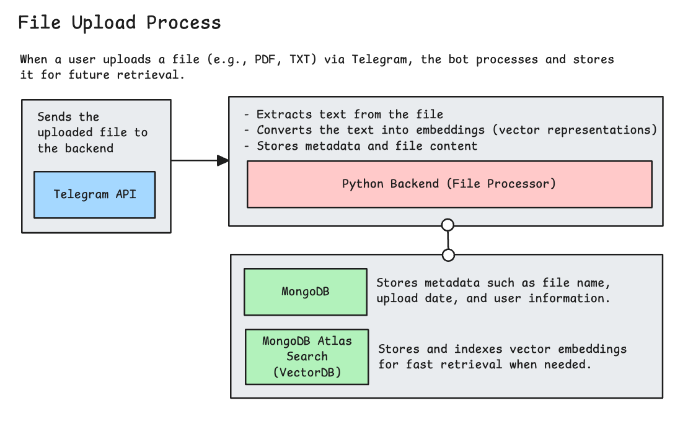
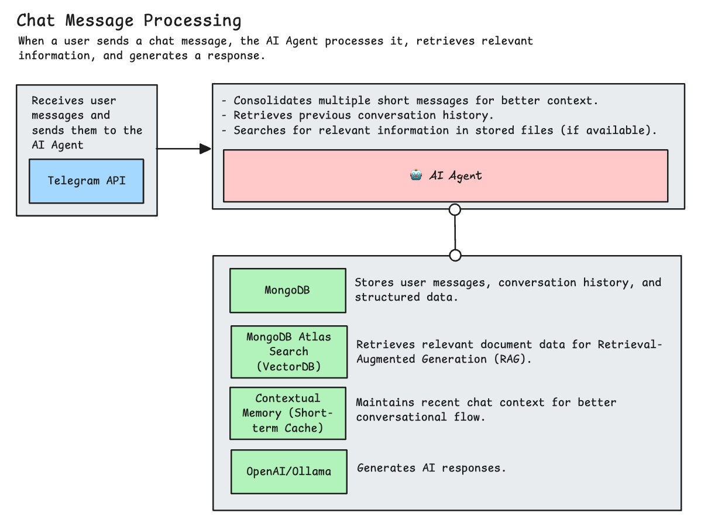

# Telegram Multi-Agent AI Bot

**Telegram Multi-Agent AI Bot** is a powerful, AI-driven chatbot designed to intelligently process and respond to user messages on Telegram. Leveraging **OpenAI GPT-4o-mini**, **LangChain**, and **MongoDB Atlas Search**, this bot consolidates multiple short messages into a context-aware conversation, retrieves relevant information from stored documents, and generates coherent responses.

---

## 🚀 Features

- **💬 Telegram Bot Integration** – Seamlessly interacts with users on Telegram.
- **🧠 AI-Powered Message Processing** – Uses **LangChain** and **OpenAI GPT-4o-mini** for intelligent responses.
- **🪠 Contextual Memory (MongoDB Atlas Search)** – Retrieves and utilizes previous conversations for enhanced response accuracy.
- **📄 File Upload & Retrieval** – Stores documents in **MongoDB Atlas Search** for retrieval-augmented generation (RAG).
- **🗂️ MongoDB-Based Message Queue** – Manages incoming messages efficiently.
- **✨ FastAPI Web Server** – Provides a scalable and modern backend.
- **🛠️ Python Virtual Environment Support** – Ensures easy dependency management.

---

## 🛠 Installation Guide

### 1. Set Up a Virtual Environment
```bash
# Create a virtual environment
make venv

# Activate the virtual environment (MacOS/Linux)
source venv/bin/activate
```

### 2. Install Dependencies
```bash
make install
```

### 3. Set Up MongoDB Atlas
- Create a **MongoDB Atlas** cluster.
- Enable **Atlas Search** and configure an index for vector search.
- Obtain your MongoDB connection string.

### 4. Configure Environment Variables
Create a `.env` file and add the following:
```env
TELEGRAM_BOT_TOKEN=your_telegram_bot_token
OPENAI_API_KEY=your_openai_api_key
MONGODB_URI=your_mongodb_atlas_connection_string
```

---

## ▶️ Usage

### 1. Activate the Virtual Environment
```bash
source venv/bin/activate
```

### 2. Start the Application
```bash
make run
```

### 3. Interact with the Bot
- Start by sending `/start` to the bot.
- Send multiple short messages within **15 seconds** for contextual merging.
- Upload files (PDF, TXT, etc.) to enrich responses with document-based knowledge.

---

## 🎨 System Architecture


1. **Message Reception**
   - The Telegram bot receives incoming messages.
   - Messages are stored in a **MongoDB queue**.



2. **File Upload & Processing**
   - Users upload files via Telegram.
   - Documents are stored in **MongoDB Atlas Search** for future retrieval.



3. **Message Processing**
   - Messages sent within **15 seconds** are consolidated.
   - Context is retrieved from **MongoDB Atlas Search**, including previously uploaded documents.
   - OpenAI's **GPT-4o-mini**, via **LangChain**, generates responses.

4. **Response Delivery**
   - The response is sent back to the user.
   - Interaction data is stored in **MongoDB Atlas Search**.
   - Processed messages are removed from the queue.

---

## 📃 Makefile Commands

| Command               | Description |
|-----------------------|-------------|
| `make venv`          | Creates a virtual environment |
| `make install`       | Installs dependencies |
| `make run`           | Starts the application |
| `make clean`         | Removes Python cache files |


